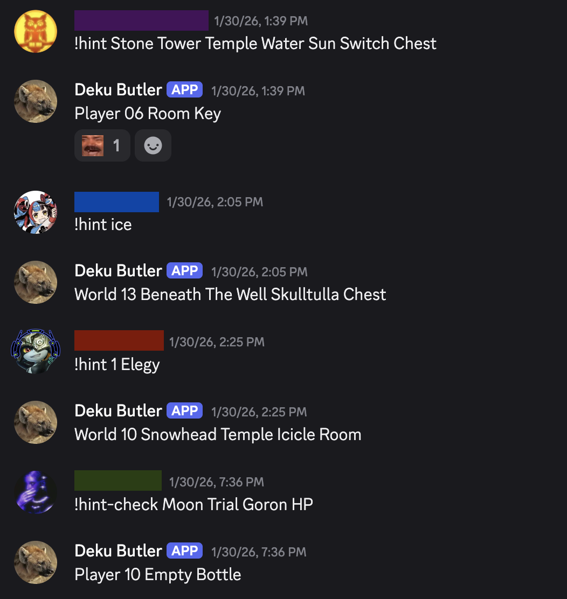

This is a Discord bot that provides hints for Zelda: Ocarina of Time/Majora's Mask Combo Randomizer ([OoTMM](https://ootmm.com/)). It works for both single-player and [multiworld](https://ootmm.com/multiplayer) games.

### What is that?
Randomizers are mods that randomize where a game's items are located. In Zelda games, major items are normally found in the same place every time you play the game. When playing a randomizer, you might find them anywhere: in a chest, as a quest reward, or even in a random pot. This bot reveals item locations (and various other hints) specifically for the OoTMM randomizer, which allows you to play both Ocarina of Time and Majora's Mask with items shuffled among both games.

While the bot works for single-player games, it was made with multiworlds in mind. A multiworld is a team effort in which multiple people play OoTMM while connected to a central server. Each player has their own game to complete, but everyone's items are distributed among everyone's games. While playing your own game, you will find other players' items, which will be sent to them via the server. (Essentially [Archipelago](https://archipelago.gg/) but everyone is playing OoTMM.)

This means you are reliant on other players to find most of your items, and it's not uncommon to get stuck. If everyone gets stuck, this hint bot is useful to figure out how to progress the game without getting too many spoilers.

### The bot in action
Here you can see the bot providing hints to players in a multiworld. The first and last hints show what the player will get if they check the specified location in their game, while the second and third hints reveal where to find the specified item.

